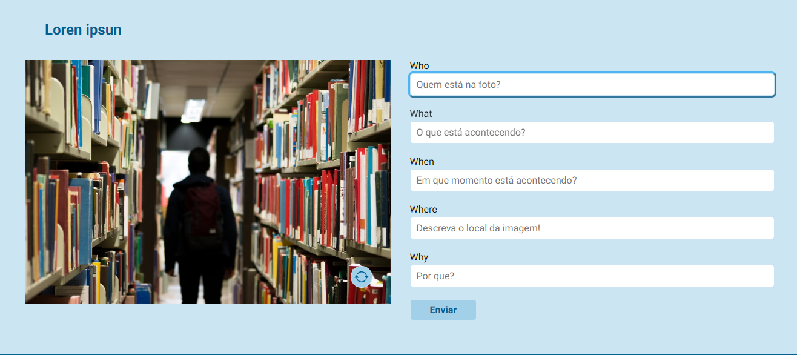
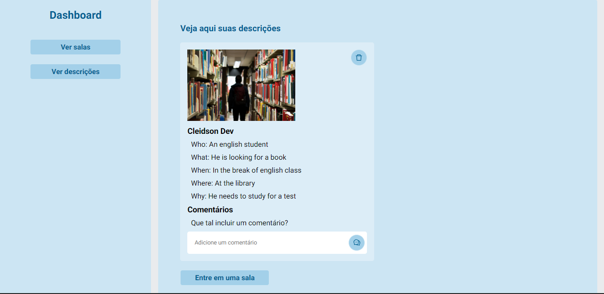

  <h1 align="center">5Ws</h1>

  <h3 align="center">Esse repositório contém os códigos da aplicação do 5Ws.</h3>
     

  

    Basicamente a página é construída com intuito de desenvolver habilidades em NEXT JS, além contribuir para o aprendizado de línguas, usando os 5Ws ou <i>word questions</i>.
     
     
    Construído utilisando <b>React-Js</b> e boas praticas de acessibilidade e responsividade para ser um facilitador na hora da utilização.
  

 

 

## Table of Contents

* [Recursos](#recursos)
* [Tecnologias](#tecnologias)
* [Screenshoots](#screenshoots)
* [Autor](#autor)
* [Licença](#licença)
* [Agradecimentos](#agradecimentos)

 

## Recursos
Aqui está os principais recursos atuais desta aplicação:

### Implementado

- 🟩 Sign in utilizando Next Auth
- 🟩 Descrever as imagens usando o 5Ws
- 🟩 Criar espaços (Salas) para receber descrições
- 🟩 Criar comentários para descrições (de forma privada)

### Implementações futuras

- 🟥 Criar comentários para descrições (de forma pública)

 

## Tecnologias

- [Typescript](https://www.typescriptlang.org/)
- [React js](https://reactjs.org/)
- [Next js](https://reactjs.org/)
- [Next Auth](https://next-auth.js.org/)
- [Styled-components](https://styled-components.com)
- [Axios](https://axios-http.com/ptbr/)
- [Faunadb](https://docs.fauna.com/fauna/current/learn/introduction/)
- [Lodash](https://lodash.com/)
- [React-icons](https://react-icons.github.io/react-icons/)
- [React-toastify](https://fkhadra.github.io/react-toastify/introduction)
 

## Screenshoots
Abaixo estão algumas imagens demonstrando o funcionamento da aplicação.
 

### Página para descrição das imagens :
 

- É possível mudar imagens ao clicar no botão no canto inferior direito na imagem.
- Os campos são para descrever as imagens usando a técnica dos 5Ws.
 
 

 
 
 

### Página Dashboard :
 

- No dashboard é possível visualizar as descrições realizadas por você e por outras pessoas nas suas salas.
- A pessoa que criou a descrição e o criador da sala podem comentar sobre a descrição.
- Quem criou a descrição pode apaga-lá com o botão no canto superior direito.
 
 

 
 

## Autor
* **Cleidson Oliveira** 
 

## Licença
This project is licensed under the MIT License - see the [LICENSE](LICENSE) file for details

 

## Agradecimentos
* Àqueles cujo utilizei códigos abertos como base para construir este projeto
* Pessoas que contribuíram com inspiração ou idéia
* etc...

 

### _Ainda em construção..._
